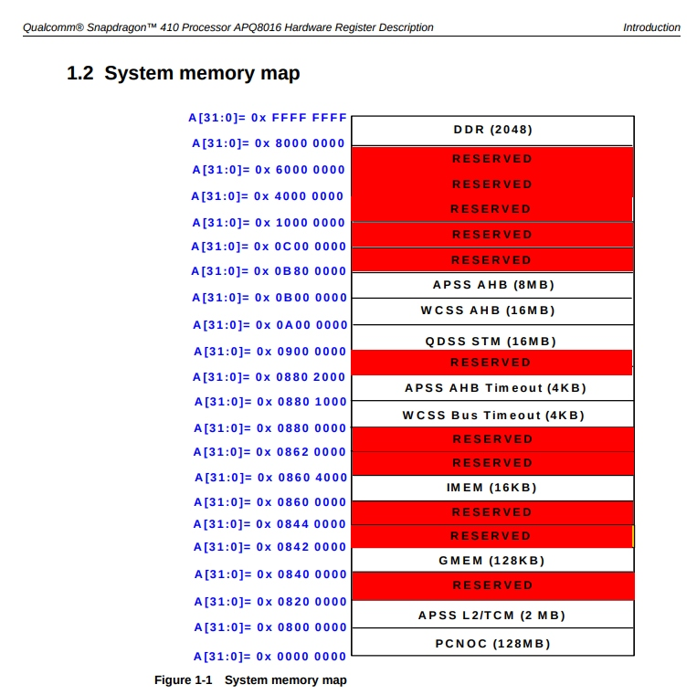
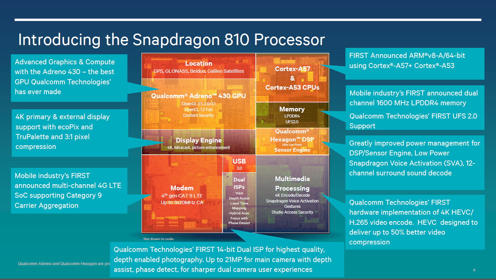

# SoC Info
## Memory Map

**Note: Memory map of later models not publicly available**

## IPs

- [Qualcomm 845 Overview](https://www.qualcomm.com/media/documents/files/snapdragon-845-mobile-platform-product-brief.pdf)
  - Qualcomm Spectra 280 Image Signal Processor
  - Qualcomm Adreno 630 Visual Processing Subsystem
  - Qualcomm Hexagon 685 DSP
  - Qualcomm Snapdragon X20 LTE modem
  - Qualcomm Kryo 385 CPU
